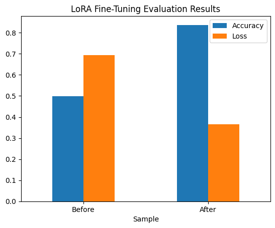

# Project: Apply Lightweight Fine-Tuning to a Foundation Model

## Overview

For my first project, I opted for a parameter-efficient fine-tuning (PEFT) approach, leveraging the LoRA technique, to refine the capabilities of the distilbert-base-uncased model from Hugging Face. This choice was driven by the necessity of balancing computational efficiency and the model's adaptability to specific tasks. The LoRA technique stands out for its ability to efficiently adapt large models like DistilBERT to new tasks with minimal computational overhead, making it an ideal candidate for this project.

I selected the distilbert-base-uncased[^1] model for its efficiency and versatility across various NLP tasks, paired with its relatively lightweight architecture, which complements the computational benefits of LoRA. 

For evaluating the model's performance pre- and post-fine-tuning, I employed the Hugging Face Evaluate[^2] library. This choice was motivated by its ease of integration with the Hugging Face ecosystem, providing a straightforward and standardized method for assessing model performance.

The amazon_polarity[^3] dataset served as the foundation for fine-tuning. It was chosen for its relevance to real-world sentiment analysis tasks and its substantial volume, offering a rich source of diverse textual examples for model refinement.

Instead of using the computational resources provided by the course, I conducted my work on my hardware, leveraging my GPU. This decision was made to fully capitalize on the hardware's capabilities, ensuring more rapid iteration and experimentation.[^4]

After fine-tuning, the model's accuracy significantly improved, going from 0.50276 to 0.824080. This enhancement underscores the effectiveness of the selected PEFT technique and the fine-tuning process.

I need to explore hyperparameter tuning further to optimize the model's performance.

My work heavily relied on the Hugging Face documentation and a hands-on experimentation approach.[^5]

[!NOTE]
For help with my writing, I asked Grammarly to respond to these AI prompts:

Prompts created by Grammarly
- "Improve it"

References:
[^1]: distilbert/distilbert-base-uncased · Hugging Face. https://huggingface.co/distilbert/distilbert-base-uncased
[^2]: 🤗 Evaluate. https://huggingface.co/docs/evaluate/index
[^3]: amazon_polarity · Datasets at Hugging Face. https://huggingface.co/datasets/amazon_polarity
[^4]: Methods and tools for efficient training on a single GPU. https://huggingface.co/docs/transformers/v4.39.3/en/perf_train_gpu_one#using--peft
[^5]: Fine-tune a pretrained model. Hugging Face Documentation. https://huggingface.co/docs/transformers/training
  Load adapters with PEFT. Hugging Face Documentation. https://huggingface.co/docs/transformers/peft
