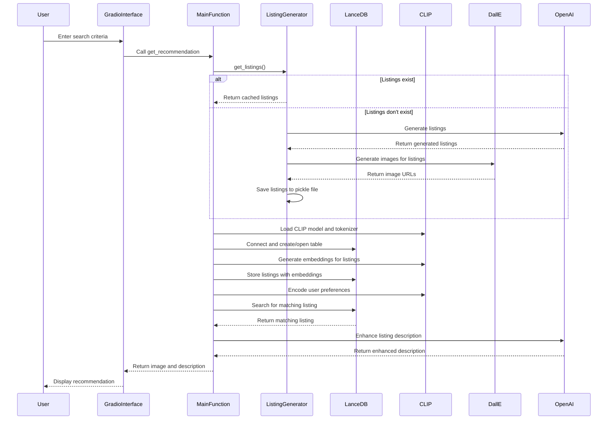

```mermaid
sequenceDiagram
    participant User
    participant GradioInterface
    participant MainFunction
    participant ListingGenerator
    participant LanceDB
    participant CLIP
    participant DallE
    participant OpenAI

    User->>GradioInterface: Enter search criteria
    GradioInterface->>MainFunction: Call get_recommendation
    MainFunction->>ListingGenerator: get_listings()
    alt Listings exist
        ListingGenerator-->>MainFunction: Return cached listings
    else Listings don't exist
        ListingGenerator->>OpenAI: Generate listings
        OpenAI-->>ListingGenerator: Return generated listings
        ListingGenerator->>DallE: Generate images for listings
        DallE-->>ListingGenerator: Return image URLs
        ListingGenerator->>ListingGenerator: Save listings to pickle file
    end
    MainFunction->>CLIP: Load CLIP model and tokenizer
    MainFunction->>LanceDB: Connect and create/open table
    MainFunction->>CLIP: Generate embeddings for listings
    MainFunction->>LanceDB: Store listings with embeddings
    MainFunction->>CLIP: Encode user preferences
    MainFunction->>LanceDB: Search for matching listing
    LanceDB-->>MainFunction: Return matching listing
    MainFunction->>OpenAI: Enhance listing description
    OpenAI-->>MainFunction: Return enhanced description
    MainFunction-->>GradioInterface: Return image and description
    GradioInterface-->>User: Display recommendation
```