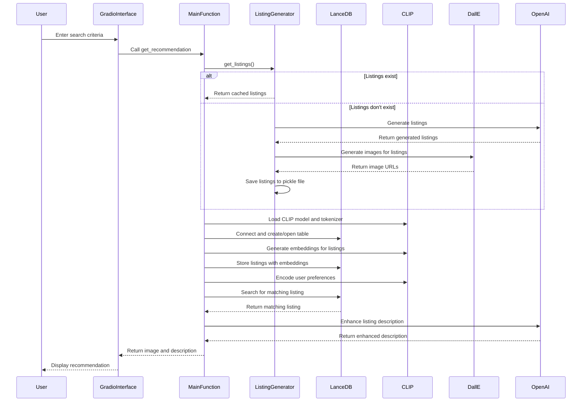

## Overview
HomeMatch is a smart real estate agent application that uses AI to generate and recommend real estate listings based on user preferences. It utilizes several AI models and technologies, including OpenAI's GPT for text generation, DALL-E for image generation, and CLIP for embedding generation and similarity search.
## Key Components
### Dependencies

- gradio: For creating the user interface
- lancedb: For vector database operations
- torch and transformers: For working with the CLIP model
- langchain: For integrating with OpenAI's models
- pydantic: For data validation and settings management

### Main Classes

- RealEstateListing: Pydantic model for individual real estate listings
- RealEstateListings: Pydantic model for a collection of listings
- RealEstateListingLanceDB: LanceDB model for storing listings with embeddings

### Key Functions

- generate_listings(): Generates new real estate listings using OpenAI's GPT
- get_listings(): Retrieves or generates listings
- find_listing(): Searches for a matching listing based on user preferences
- get_recommendation(): Main function to get a property recommendation
- get_listing_embeddings(): Generates embeddings for a listing using CLIP
- generate_embeddings(): Generates embeddings for all listings
- main(): Entry point of the application

### Workflow

- The application starts by loading or generating real estate listings.
- Listings are stored in a LanceDB database along with their CLIP embeddings.
- When a user inputs their preferences, the application:
  - Encodes the preferences using CLIP
  - Searches the LanceDB for similar listings
  - Selects a matching listing
  - Enhances the listing description (TODO)
  - Returns the listing image and description to the user



### User Interface
The application uses Gradio to create a user-friendly interface with the following inputs:

- Description (text input)
- State (dropdown)
- City (dropdown)
- Property Type (dropdown)
- Bedrooms (slider)
- Bathrooms (slider)
- Budget (slider)
-Amenities (checkbox group)

The output displays the recommended property image and its description.
### Data Storage

Listings are cached in a pickle file (listings.pickle) for quick access.

Images are stored in the images directory.

The LanceDB database is stored in the data/lancedb directory.

### AI Models

- OpenAI's GPT-3.5-turbo: Used for generating listing descriptions
- DALL-E: Used for generating property images
- CLIP: Used for generating embeddings and similarity search

## TODO Items

- Implement filtering in the find_listing() function using LanceDB's querying capabilities.
- Enhance the listing description using an LLM in the enhance_listing_description() function.
- Improve the embedding generation by incorporating more listing properties.

## Running the Application
To run the application, ensure all dependencies are installed and environment variables are set (particularly OpenAI API key). Then, simply run:
```bash
python HomeMatch.py
``` 
The Gradio interface will launch, allowing users to interact with the HomeMatch system.

Here's the evaluation in markdown format using tables:

# HomeMatch Project Evaluation

## Synthetic Data Generation

| Criteria | Requirement | Met? | Implementation |
|----------|-------------|------|----------------|
| Generating Real Estate Listings with an LLM | Generate at least 10 diverse and realistic listings containing facts about the real estate | ✅ | The `generate_listings()` function uses GPT-3.5-turbo to create 15 detailed listings including title, location, price, property details, and descriptions. |

## Semantic Search

| Criteria | Requirement | Met? | Implementation |
|----------|-------------|------|----------------|
| Creating a Vector Database and Storing Listings | Create a vector database and store real estate listing embeddings | ✅ | LanceDB is used to create a vector database. The `generate_embeddings()` function creates embeddings using CLIP and stores them in LanceDB along with listing details. |
| Semantic Search of Listings Based on Buyer Preferences | Implement functionality to semantically search listings based on buyer preferences | ✅ | The `find_listing()` function encodes buyer preferences with CLIP and searches the LanceDB table for similar listings. |

## Augmented Response Generation

| Criteria | Requirement | Met? | Implementation |
|----------|-------------|------|----------------|
| Logic for Searching and Augmenting Listing Descriptions | Implement logic to search and augment listing descriptions based on buyer preferences | 🟨 | Searching is implemented in `find_listing()`, but augmentation is a TODO in `enhance_listing_description()`. |
| Use of LLM for Generating Personalized Descriptions | Use an LLM to generate personalized descriptions based on buyer preferences | 🟨 | Initial listings are generated with GPT-3.5-turbo, but personalization based on preferences is not yet implemented. |

## Legend
- ✅ Fully Met
- 🟨 Partially Met

## Summary

The HomeMatch project meets most of the core requirements of the rubric. It successfully implements synthetic data generation and semantic search functionalities. However, to fully satisfy all criteria, the project needs to complete the implementation of augmented response generation:

1. Implement the `enhance_listing_description()` function to use an LLM for generating personalized descriptions based on buyer preferences.
2. Ensure that the augmented descriptions personalize the listing without altering factual information.

Once these additions are made, the project will fully meet all the rubric requirements for a Personalized Real Estate Agent.