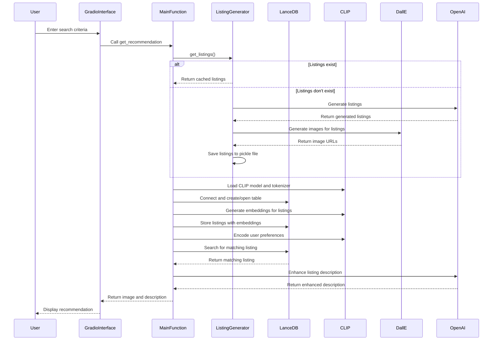

# HomeMatch.py Documentation

## Overview

HomeMatch is a smart real estate agent application that uses AI to generate, store, and recommend real estate listings based on user preferences. It utilizes several AI models and technologies, including OpenAI's GPT for text generation, DALL-E for image generation, and CLIP for embedding generation and similarity search.

## Key Components

### Dependencies

- `gradio`: For creating the user interface
- `lancedb`: For vector database operations
- `torch` and `transformers`: For working with the CLIP model
- `langchain`: For integrating with OpenAI's models
- `pydantic`: For data validation and settings management

### Main Classes

| Class | Description |
|-------|-------------|
| `RealEstateListing` | Pydantic model for individual real estate listings |
| `RealEstateListings` | Pydantic model for a collection of listings |
| `RealEstateListingLanceDB` | LanceDB model for storing listings with embeddings |

### Key Functions

| Function | Description |
|----------|-------------|
| `generate_listings()` | Generates new real estate listings using OpenAI's GPT |
| `get_listings()` | Retrieves or generates listings |
| `find_listing()` | Searches for a matching listing based on user preferences |
| `enhance_listing_description()` | Enhances listing description based on user preferences |
| `get_recommendation()` | Main function to get a property recommendation |
| `get_listing_embeddings()` | Generates embeddings for a listing using CLIP |
| `generate_embeddings()` | Generates embeddings for all listings |
| `main()` | Entry point of the application |

## Workflow

1. The application starts by loading or generating real estate listings.
2. Listings are stored in a LanceDB database along with their CLIP embeddings.
3. When a user inputs their preferences, the application:
   - Encodes the preferences using CLIP
   - Searches the LanceDB for similar listings
   - Selects a matching listing
   - Enhances the listing description based on user preferences
   - Returns the listing image and enhanced description to the user




## User Interface

The application uses Gradio to create a user-friendly interface with the following inputs:

- Description (text input)
- Bedrooms (slider)
- Bathrooms (slider)
- Budget (slider)
- Amenities (checkbox group)

The output displays the recommended property image and its enhanced description.

## Data Storage

- Listings are cached in a pickle file (`listings.pickle`) for quick access.
- Images are stored in the `images` directory.
- The LanceDB database is stored in the `data/lancedb` directory.

## AI Models

- OpenAI's GPT-3.5-turbo: Used for generating listing descriptions and enhancing them
- DALL-E: Used for generating property images
- CLIP: Used for generating embeddings and similarity search

## Running the Application

To run the application, ensure all dependencies are installed and environment variables are set (particularly OpenAI API key). Then, simply run:

```bash
export OPENAI_API_KEY="Your OPENAI API Key"
pip install -r requirements.txt
python HomeMatch.py
```

The Gradio interface will launch, allowing users to interact with the HomeMatch system.

# HomeMatch Project Evaluation

This document outlines how the HomeMatch project meets the criteria and requirements specified in the project rubric for a Personalized Real Estate Agent.

## Criteria Fulfillment

| Criteria | Requirement | Met? | Implementation |
|----------|-------------|------|----------------|
| Synthetic Data Generation | Generate at least 10 diverse and realistic real estate listings using an LLM | ✅ | The `generate_listings()` function uses GPT-3.5-turbo to create 15 detailed listings. |
| Creating a Vector Database | Create a vector database and store real estate listing embeddings | ✅ | LanceDB is used to create a vector database. The `generate_embeddings()` function creates embeddings using CLIP and stores them in LanceDB. |
| Semantic Search | Implement functionality to semantically search listings based on buyer preferences | ✅ | The `find_listing()` function encodes buyer preferences with CLIP and searches the LanceDB table for similar listings. |
| Logic for Searching and Augmenting Descriptions | Implement logic to search and augment listing descriptions based on buyer preferences | ✅ | The `get_recommendation()` function combines searching and augmentation, calling `find_listing()` and `enhance_listing_description()`. |
| Use of LLM for Generating Personalized Descriptions | Use an LLM to generate personalized descriptions based on buyer preferences | ✅ | The `enhance_listing_description()` function uses GPT-3.5-turbo to generate personalized descriptions based on user preferences. |

